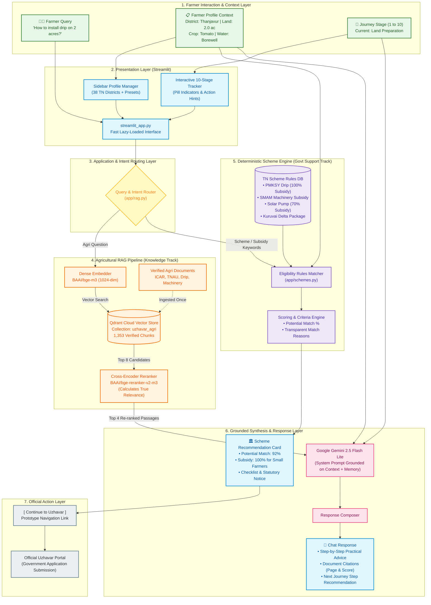
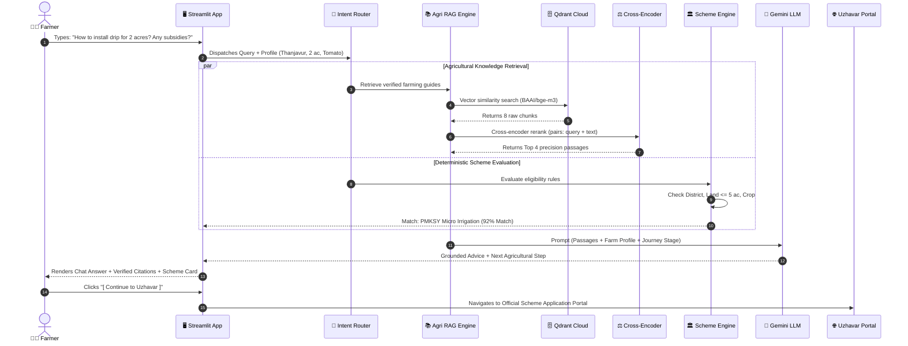

# 🌾 Uzhavar AI — Architecture & System Specification
### Intelligent Farmer Journey & Scheme Discovery Platform

---

## 1. High-Level Conceptual Architecture

Uzhavar AI is built on a **Dual-Track Core Architecture**: general agricultural inquiries are grounded through **Retrieval-Augmented Generation (RAG)**, while government support is discovered through a **Deterministic Scheme Eligibility Engine**.

```
                           ┌───────────────────────────────┐
                           │      FARMER / USER            │
                           │   • Profile (District, Acres) │
                           │   • Journey Stage (1 of 10)   │
                           │   • Natural Language Query    │
                           └──────────────┬────────────────┘
                                          │
                                          ▼
                           ┌───────────────────────────────┐
                           │     STREAMLIT WEB APP         │
                           │  • Profile Management Panel   │
                           │  • 10-Stage Journey Tracker   │
                           │  • Chat & Card Interface      │
                           └──────────────┬────────────────┘
                                          │
                                          ▼
                           ┌───────────────────────────────┐
                           │   CONTEXT & INTENT ROUTER     │
                           │  • Injects Farm Profile       │
                           │  • Injects Journey Stage      │
                           │  • Evaluates Scheme Intent    │
                           └──────┬─────────────────┬──────┘
                                  │                 │
            ┌─────────────────────┘                 └──────────────────────┐
            ▼                                                              ▼
┌───────────────────────────────┐                      ┌───────────────────────────────┐
│     TRACK A: RAG ENGINE       │                      │   TRACK B: ELIGIBILITY ENGINE │
│ (Agricultural Knowledge)      │                      │ (Government Schemes)          │
│                               │                      │                               │
│ 1. Vector Search (bge-m3)     │                      │ 1. Deterministic Rule Match   │
│ 2. Qdrant Cloud (1,353 chunks)│                      │    (District, Acres, Crop)    │
│ 3. Cross-Encoder Reranker     │                      │ 2. Subsidy Tier Evaluation    │
│ 4. Grounded Context Passages  │                      │ 3. Potential Match Score (%)  │
└──────────────┬────────────────┘                      └──────────────┬────────────────┘
               │                                                      │
               └──────────────────────┬───────────────────────────────┘
                                      │
                                      ▼
                       ┌───────────────────────────────┐
                       │       GEMINI 2.5 FLASH        │
                       │  Synthesizes Grounded Advice  │
                       │  + Next Journey Step Advice   │
                       └──────────────┬────────────────┘
                                      │
                                      ▼
                       ┌───────────────────────────────┐
                       │     RESPONSE COMPOSER         │
                       │  • Grounded Answer + Citations│
                       │  • Scheme Card (if eligible)  │
                       └──────────────┬────────────────┘
                                      │
                         [ Continue to Uzhavar ]
                                      │
                                      ▼
                       ┌───────────────────────────────┐
                       │   OFFICIAL UZHAVAR PORTAL     │
                       │   (External Govt Processing)  │
                       └───────────────────────────────┘
```

---

## 2. Detailed Technical Architecture Diagram



---

## 3. End-to-End Query Sequence Diagram



---

## 4. Final Features of Uzhavar AI

### 4.1 Conversational Farming Assistant
- Natural language interaction in **English**, **தமிழ் (Tamil)**, and **Tanglish**.
- Handles planning, crop selection, sowing, fertilizer dosage, irrigation, machinery, pest identification, harvesting, and marketing.
- Retains multi-turn conversation memory within the session.

### 4.2 Dynamic Farmer Profile Context
- Maintains farmer attributes in every request:
  - **Location**: All 38 districts of Tamil Nadu.
  - **Land Size & Category**: Automatically categorizes as *Marginal* ($\le 2.5\text{ ac}$), *Small* ($2.5 - 5\text{ ac}$), or *Large* ($> 5\text{ ac}$).
  - **Farming Parameters**: Water source, soil type, primary crop, ownership (owner/tenant), and farming goal.
- Personalizes answers to the farmer's specific scale (e.g. 2 acres vs 15 acres).

### 4.3 10-Stage Farmer Journey Tracker
Tracks the complete agricultural lifecycle:
$$\text{Planning} \rightarrow \text{Crop Selection} \rightarrow \text{Land Prep} \rightarrow \text{Seed Selection} \rightarrow \text{Sowing}$$
$$\rightarrow \text{Crop Mgmt} \rightarrow \text{Pest/Disease Mgmt} \rightarrow \text{Harvest} \rightarrow \text{Marketing} \rightarrow \text{Next Season}$$
- Visual progress bar with completed (`✓`), active (`●`), and upcoming (`○`) indicators.
- Proactively recommends the next logical agricultural action.

### 4.4 Grounded RAG with Citations
- Relies exclusively on verified ICAR, TNAU, and government agricultural manuals.
- Does not hallucinate unverified chemical doses or subsidy figures.
- Expandable citation drawer displaying document title, page number, and similarity score.

### 4.5 Contextual Government Scheme Discovery
- Triggers automatically from natural conversation without requiring the farmer to search.
- Rule-based evaluation ensures accuracy.
- Displays a **Scheme Card** with:
  - Potential Match Percentage (e.g., **92%**)
  - Department and Subsidy details
  - Itemized match reasons
  - Required documents checklist
  - Statutory notice: *"Final eligibility is subject to government verification."*
  - Prototype button: `[ Continue to Uzhavar ]`

---

## 5. What Is Done (Current Implementation Status)

| Module / Component | File Location | Status | Details |
| :--- | :--- | :---: | :--- |
| **Qdrant Vector Database** | Cloud Instance | ✅ Done | **1,353 chunks** indexed in `uzhavar_agri` collection from verified PDFs. |
| **Dense Embedder** | `app/config.py`, `app/rag.py` | ✅ Done | `BAAI/bge-m3` running locally with cached offline loading. |
| **Cross-Encoder Reranker**| `app/rag.py` | ✅ Done | `BAAI/bge-reranker-v2-m3` for high-precision passage scoring. |
| **Grounded LLM Prompt** | `app/rag.py` | ✅ Done | Gemini 2.5 Flash Lite with multi-turn memory and journey stage awareness. |
| **Deterministic Schemes** | `app/schemes.py` | ✅ Done | Curated Tamil Nadu schemes (PMKSY, SMAM, Solar KUSUM, KAVIADP, PMFBY, Kuruvai). |
| **Data Schemas** | `app/models.py` | ✅ Done | Pydantic models for `FarmerProfile`, `FARMING_STAGES`, `SchemeRecommendation`. |
| **FastAPI REST API** | `app/main.py` | ✅ Done | Endpoints for `/chat`, `/stages`, `/schemes`, `/eligibility/check`, `/health`. |
| **Streamlit Interface** | `streamlit_app.py` | ✅ Done | Fast lazy-loaded UI (< 2 sec startup), 10-stage tracker, profile manager, scheme cards. |
| **File Watcher Config** | `.streamlit/config.toml` | ✅ Done | `fileWatcherType = "none"` eliminates `torchvision` warnings and speeds up boot. |

---

## 6. What Is Left (Roadmap)

### Phase 1: High Priority (Completing Current Scope)
1. **Schemes Eligibility RAG Pipeline**:
   - Ingest government G.O. circulars and scheme guidelines into a dedicated Qdrant collection (`uzhavar_schemes`) for answering specific administrative questions.
2. **Uzhavar Prototype Linking**:
   - Connect the `[ Continue to Uzhavar ]` button to your prototype URL, passing pre-filled parameters (`?scheme_id=...&district=...&acres=...`).

### Phase 2: Medium Priority (Persistence & User Management)
1. **Relational Database Storage (PostgreSQL / SQLite)**:
   - Store farmer profiles and past conversation history across sessions.
2. **Farmer Authentication**:
   - Mobile OTP or farmer ID login.
3. **Admin Management Dashboard**:
   - Portal for agricultural officers to upload documents, add schemes, and monitor farmer queries.

### Phase 3: Future Enhancements
1. **Tamil Voice Interaction (STT / TTS)**: Voice query input for regional dialects.
2. **Pest/Disease Image Identification**: Camera upload with Gemini vision analysis.
3. **Live Mandi Prices & Weather Alerts**: Real-time market prices and weather updates.

---

## 7. How to Run

```powershell
# Launch Streamlit Application:
.\.venv\Scripts\streamlit.exe run streamlit_app.py

# Launch FastAPI Backend (Optional):
.\.venv\Scripts\uvicorn.exe app.main:app --reload --port 8000
```
